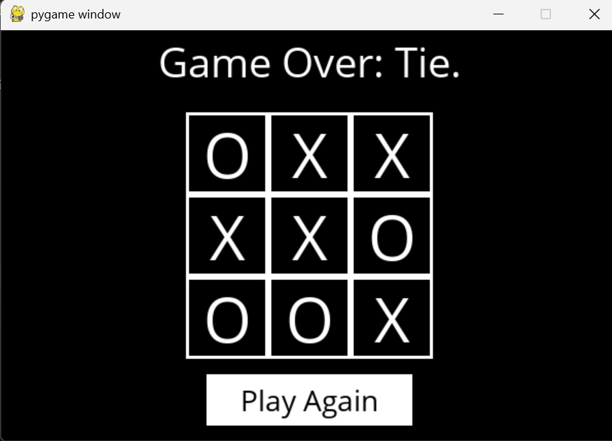

# CS3081 – Assignment 1  
## Tic-Tac-Toe AI using Minimax with Alpha-Beta Pruning

## Student Information
Name: Farah Alnaqib  
Student ID: S22107915
---

## Board Representation
The Tic-Tac-Toe board is represented as a 3×3 list of lists in Python.  
Each cell can contain one of the following values:
- `"X"` for player X
- `"O"` for player O
- `None` to represent an empty cell

Rows and columns are indexed from 0 to 2.

---

## Approach
I implemented an AI player for Tic-Tac-Toe using the **Minimax algorithm**, which guarantees optimal play.

- Player **X** is the maximizing player.
- Player **O** is the minimizing player.
- X always plays first, and players alternate turns.

The Minimax algorithm recursively explores all possible game states until a terminal state is reached.  
Each terminal state is evaluated using a utility function:
- X win → +1  
- O win → −1  
- Tie → 0  

The AI then selects the move that leads to the optimal outcome assuming the opponent also plays optimally.

---

## Key Functions
- **player(board)**: Determines whose turn it is by counting the number of X and O moves.
- **actions(board)**: Returns all possible moves available on the board.
- **result(board, action)**: Returns a new board state after applying an action using a deep copy and raises an error for invalid moves.
- **winner(board)**: Checks all rows, columns, and diagonals to determine if there is a winner.
- **terminal(board)**: Returns True if the game has ended due to a win or a tie.
- **utility(board)**: Evaluates the outcome of a terminal board state.
- **minimax(board)**: Returns the optimal move for the current player.

---

## Bonus: Alpha-Beta Pruning
To improve the efficiency of the Minimax algorithm, **Alpha-Beta Pruning** was implemented.

- **Alpha (α)** represents the best value that the maximizing player (X) can guarantee.
- **Beta (β)** represents the best value that the minimizing player (O) can guarantee.

Branches that cannot affect the final decision are pruned when β ≤ α.  
Although the performance difference is not noticeable in Tic-Tac-Toe due to the small state space, this optimization significantly reduces the number of explored states and is essential for scaling Minimax to larger games.

---

## Challenges
- Ensuring the original board was not modified during recursive search, which was solved using deep copies in `result()`.
- Correctly identifying winners across all possible rows, columns, and diagonals.
- Managing recursion in the Minimax algorithm while keeping the code clean and readable.

## Screenshots
The following screenshot shows the Tic-Tac-Toe AI playing optimally, resulting in a tie.

