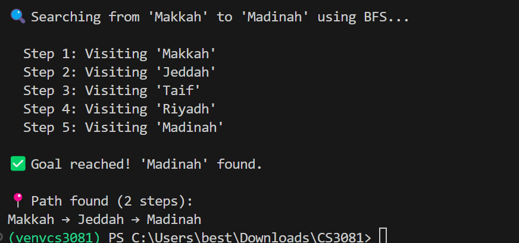

# Exercise 1 – Change the Goal City

## Answers

### (a) How many steps did BFS take to reach Madinah?

BFS took **5 steps** to reach Madinah.

---

### (b) What is the path it found?

The path found is:

Makkah → Jeddah → Madinah

---

### (c) Is this the shortest path?

Yes, this is the shortest path.

BFS explores the graph level by level and guarantees finding the shortest path in terms of number of edges. The path from Makkah to Madinah through Jeddah is the most direct route.

## Output Screenshot

