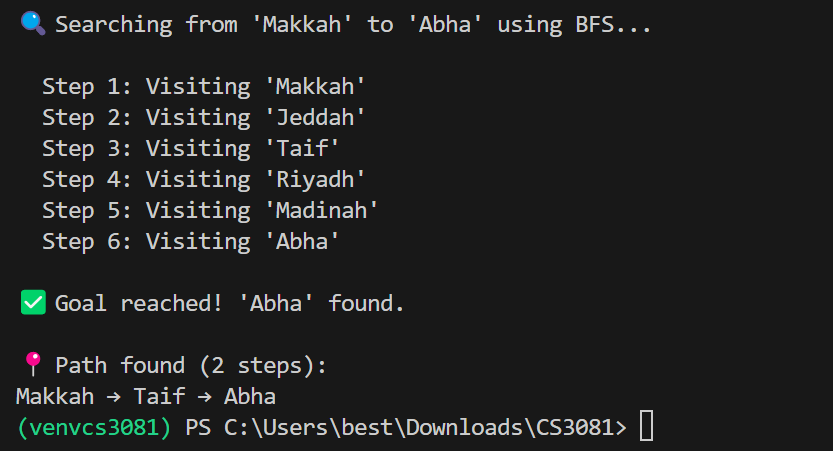

# Exercise 2 – Add a New City

## Updates Made

A new city **Abha** was added to the map and connected to **Taif**.

The following changes were made in the code:

- Added:
  `"Abha": ["Taif"]`
- Updated Taif’s neighbors to:
  `"Taif": ["Makkah", "Riyadh", "Abha"]`
- Changed the goal city to:
  `Abha`

---

## Answers

### Path found from Makkah to Abha

The BFS path found is:

Makkah → Taif → Abha

---

## Is this the shortest path?

Yes, this is the shortest path.

BFS explores the graph level by level and guarantees the shortest path in terms of number of edges. Since Abha is directly connected to Taif, and Taif is directly connected to Makkah, the path `Makkah → Taif → Abha` is optimal.

## Output Screenshot

