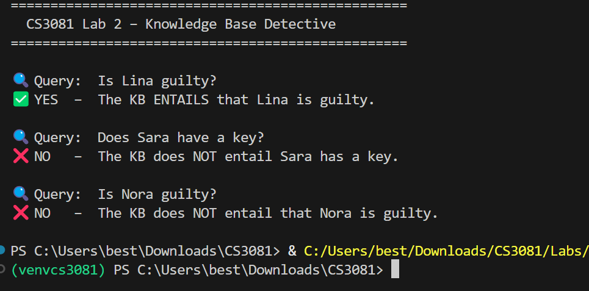

# Exercise 3 – Add a New Clue

## (a) Does the KB entail that Nora is guilty?

No, the KB does not entail that Nora is guilty.

Output:
NO – The KB does NOT entail that Nora is guilty.

---

## (b) Why not?

Although we added the fact that Nora has a key, there is no rule in the knowledge base that connects Nora having a key to being guilty.

Therefore, the system cannot logically prove that Nora is guilty.

---

## (c) What extra clue is needed?

To prove that Nora is guilty, we need to add a rule such as:

kb.tell(Implication(nora_key, nora_guilty))

This rule connects Nora having a key to being guilty.
## Output Screenshot

