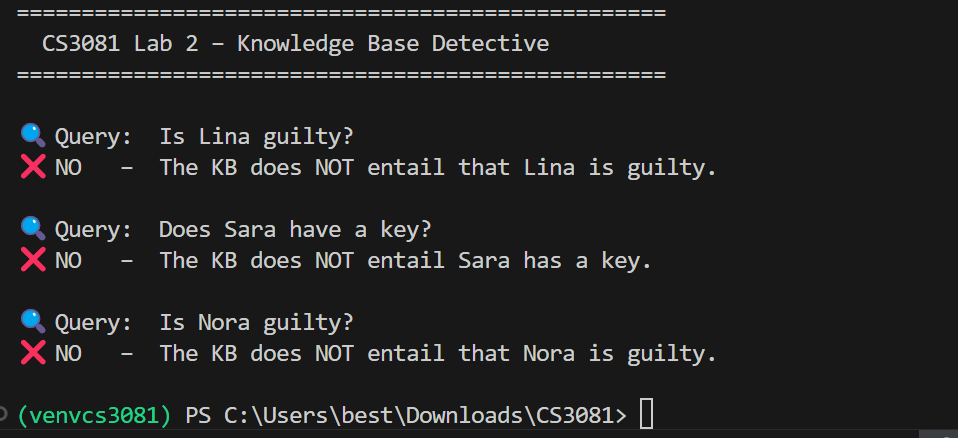

# Exercise 4 – Remove a Clue

## (a) Is Lina still guilty according to the KB?

No, Lina is no longer proven guilty.

Output:
NO – The KB does NOT entail that Lina is guilty.

---

## (b) What changed?

The clue stating that Lina was seen near the room was removed from the knowledge base.

---

## (c) Why did removing one clue change the result?

Previously, the system used the following logical chain:

- Lina was seen near the room  
- If Lina was seen near the room, then she has a key  
- If Lina has a key, then she is guilty  

After removing the first clue, this chain is broken.  
The system can no longer prove that Lina has a key, and therefore cannot prove that she is guilty.
## Output Screenshot

